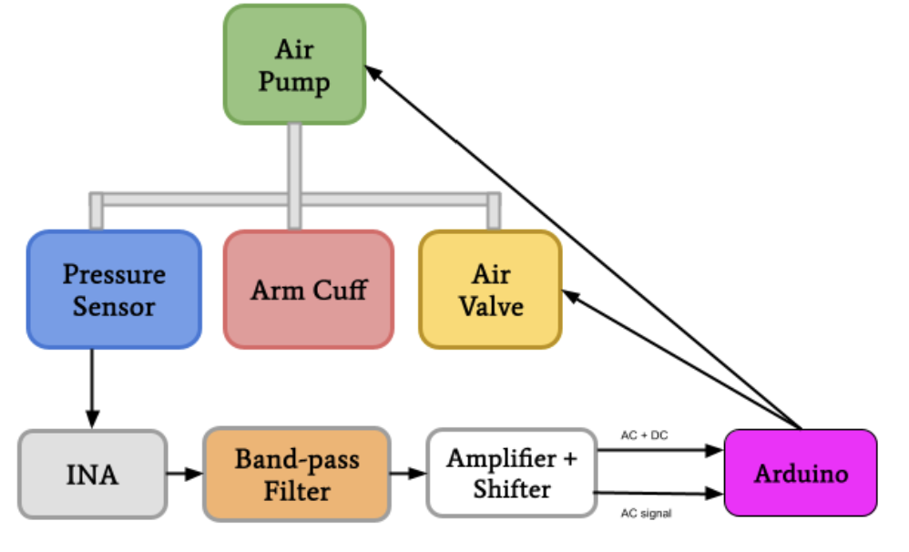
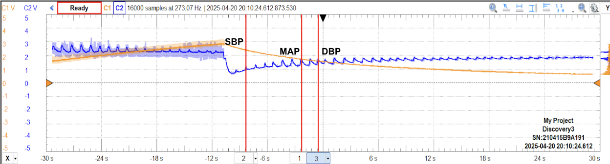
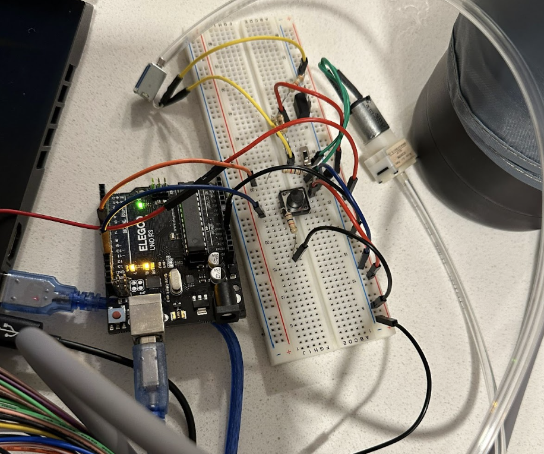

# Arduino Oscillometric Blood Pressure Monitor

Arduino-based oscillometric blood pressure measurement prototype. The system inflates a cuff until a pressure threshold is reached, then samples cuff pressure and the oscillometric waveform during deflation to estimate **SBP**, **DBP**, **MAP**, and **Heart Rate**.

---

## How it Works (Quick)

1. **Inflation**
   - Press the button to start the pump.
   - Pump turns off automatically once the pressure signal crosses a threshold.

2. **Sampling during deflation**
   - Samples pressure (DC) and oscillometric (AC) signals at **30 Hz** for **30 seconds**.
   - Data is processed in **1-second windows** (30 samples each).

3. **Oscillometric processing**
   - For each second, compute oscillometric **peak-to-peak amplitude** and associated average pressure.
   - **MAP** = pressure at maximum oscillation amplitude.
   - **SBP** found at ~**55%** of max amplitude (search backward).
   - **DBP** found at ~**75%** of max amplitude (search forward).
   - **Heart rate** estimated from timing between detected peaks.

---

## Hardware / Signals

- **Pressure input (DC / cuff pressure):** `A0`
- **Oscillometric input (AC waveform):** `A1`
- **Pump transistor control:** `D12`
- **Start button:** `D8`

---

## Validation/Results 
### Subject 1: Human male age 20

| Trial | Measurement | Our System | Commercial Sensor | Percent Difference |
|------:|-------------|------------|-------------------|--------------------|
| 1 | Systolic (mmHg) | 109.6 | 113 | 3.01% |
|   | Diastolic (mmHg) | 71.8 | 64 | 12.19% |
|   | Heart Rate (BPM) | 62.3 | 60 | 3.83% |
| 2 | Systolic (mmHg) | 122.3 | 126 | 2.94% |
|   | Diastolic (mmHg) | 64.5 | 63 | 2.38% |
|   | Heart Rate (BPM) | 67.6 | 63 | 7.30% |
| 3 | Systolic (mmHg) | 119.5 | 120 | 0.42% |
|   | Diastolic (mmHg) | 75.8 | 70 | 8.29% |
|   | Heart Rate (BPM) | 59.2 | 62 | 4.52% |

### Subject 2: Human male age 19

| Trial | Measurement | Our System | Commercial Sensor | Percent Difference |
|------:|-------------|------------|-------------------|--------------------|
| 1 | Systolic (mmHg) | 122.4 | 125 | 2.10% |
|   | Diastolic (mmHg) | 73.4 | 68 | 7.64% |
|   | Heart Rate (BPM) | 63.2 | 60 | 5.19% |
| 2 | Systolic (mmHg) | 117.2 | 112 | 4.54% |
|   | Diastolic (mmHg) | 69.5 | 72 | 3.53% |
|   | Heart Rate (BPM) | 61.7 | 62 | 0.49% |
| 3 | Systolic (mmHg) | 119.6 | 115 | 3.92% |
|   | Diastolic (mmHg) | 77.1 | 75 | 2.65% |
|   | Heart Rate (BPM) | 58.6 | 61 | 4.03% |

Overall, systolic pressure measurements were typically within 5% of the commercial monitor, with larger variation observed in diastolic pressure due to sensitivity to cuff placement and motion.

## Running the Code

1. Open `automatic_bp_cuff.ino` in the Arduino IDE
2. Select board + COM port
3. Upload
4. Open Serial Monitor at **115200 baud**
5. Press the start button to begin a measurement cycle

---

## Notes / Calibration

- Pressure conversion uses: `mmHg = volts * 50.0`  
- Pump cutoff uses ADC threshold: `analogRead(A0) > 635` (≈ 3.0 V)
- Oscillation processing uses:
  - sample rate = 30 Hz
  - total time = 30 s
  - window size = 30 samples (1 second)

---

## Repo Contents

- `README.md` — project overview
- `automatic_bp_cuff.ino` — Arduino implementation
- `media` - contains images used in README.md

---

## Disclaimer

This project pressurizes a cuff and estimates blood pressure from signals. Use caution and treat it as a lab prototype.
