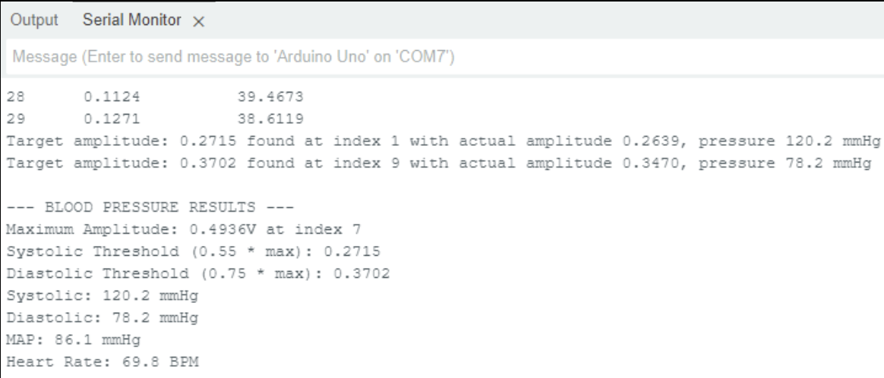

# Arduino Oscillometric Blood Pressure Monitor

Arduino-based oscillometric blood pressure measurement prototype. The system inflates a cuff until a pressure threshold is reached, then samples cuff pressure and the oscillometric waveform during deflation to estimate **SBP**, **DBP**, **MAP**, and **Heart Rate**.

> ⚠️ Educational prototype only — not a medical device.

---

## Demo / Photos

**[INSERT IMAGE: Full system photo (cuff + tubing + electronics)]**  
**[INSERT IMAGE: System block diagram]**

---

## How it Works (Quick)

1. **Inflation**
   - Press the button to start the pump.
   - Pump turns off automatically once the pressure signal crosses a threshold.

2. **Sampling during deflation**
   - Samples pressure (DC) and oscillometric (AC) signals at **30 Hz** for **30 seconds**.
   - Data is processed in **1-second windows** (30 samples each).

3. **Oscillometric processing**
   - For each second, compute oscillometric **peak-to-peak amplitude** and associated average pressure.
   - **MAP** = pressure at maximum oscillation amplitude.
   - **SBP** found at ~**55%** of max amplitude (search backward).
   - **DBP** found at ~**75%** of max amplitude (search forward).
   - **Heart rate** estimated from timing between detected peaks.

**[INSERT IMAGE: Example plot (Pressure + Oscillometric waveform with SBP/MAP/DBP markers)]**

---

## Hardware / Signals

- **Pressure input (DC / cuff pressure):** `A0`
- **Oscillometric input (AC waveform):** `A1`
- **Pump transistor control:** `D12`
- **Start button:** `D8`

**[INSERT IMAGE: Circuit schematic (sensor + conditioning + pump/valve drive)]**  
**[INSERT IMAGE: Band-pass filter schematic (~0.5–5 Hz)]**

---

## Running the Code

1. Open `automatic_bp_cuff.ino` in the Arduino IDE
2. Select board + COM port
3. Upload
4. Open Serial Monitor at **115200 baud**
5. Press the start button to begin a measurement cycle

---

## Notes / Calibration

- Pressure conversion uses: `mmHg = volts * 50.0`  
- Pump cutoff uses ADC threshold: `analogRead(A0) > 635` (≈ 3.0 V)
- Oscillation processing uses:
  - sample rate = 30 Hz
  - total time = 30 s
  - window size = 30 samples (1 second)

---

## Repo Contents

- `README.md` — project overview
- `automatic_bp_cuff.ino` — Arduino implementation

---

## Disclaimer

This project pressurizes a cuff and estimates blood pressure from signals. Use caution and treat it as a lab prototype.
